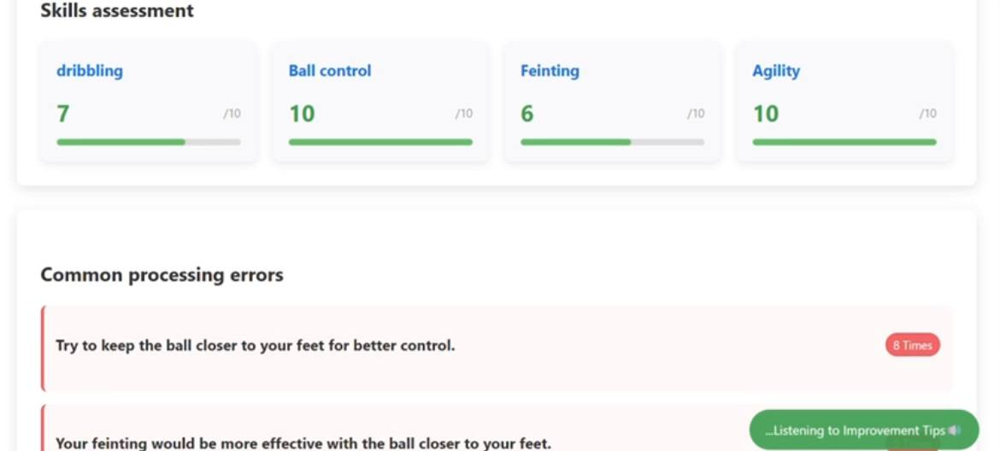

# EDI – Explore / Develop – Improve

## Overview
EDI is an AI-powered sports coaching platform that helps athletes train, improve, and get discovered.  
This version focuses on the Coach Dashboard, where coaches can evaluate players’ core football skills using AI insights.

---

## Technologies
- Python (Analysis Module)  
- OpenCV, MediaPipe, NumPy  
- HTML/CSS/JS (Web Module)  

---

## Coach Dashboard

The Coach Dashboard allows coaches to evaluate players on key football skills:
- Ball Control – measures how well the player controls the ball  
- Dribbling – assesses dribbling accuracy and speed  
- Fitness – tracks stamina and overall physical performance  
- Agility – evaluates speed, quick direction changes, and reflexes

<p align="center">
  
</p>

---

## How to Run
```bash
pip install opencv-python mediapipe numpy
python app.py
